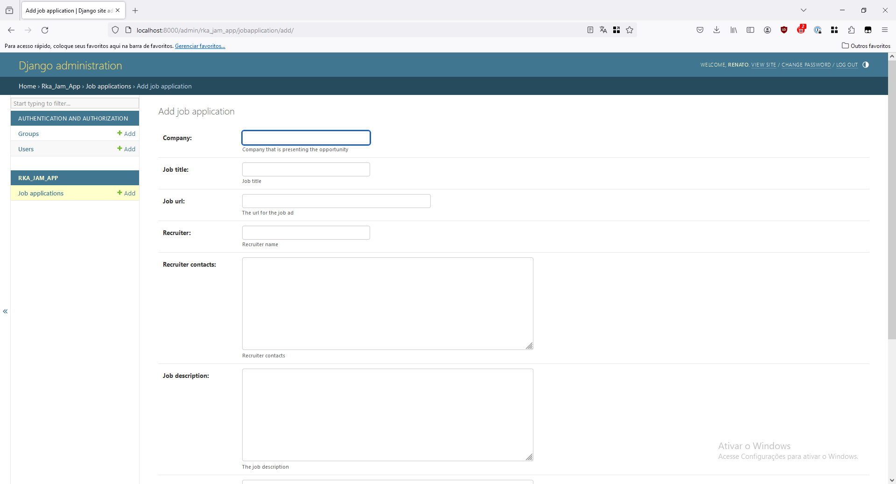

# RKA JAM - Job Application Manager

This project manages job applications from a candidate perspective.

## Technologies

- Python
- Django
- Postgres

## Description

It's a simple project with only one model ``JobApplication`` that has all the info needed to track a job application.

The job application is managed through the Django admin.

## Screenshot



## How to run locally

The application was tested using a Postgres database (although it can use other Django supported databases if the
required driver is installed and the config is adjusted in the ``.env`` file).

- Create a virtual environment and activate it
```
python -m venv venv

./venv/Scripts/activate
```
- Install the requirements
```
pip install -r requirements
```
- Create the database
- Create a ``.env`` file with the database info
```
DATABASE_URL=postgres://<db_user>:<db_password>@localhost:5432/<db_name>
```
- Run the Django commands to init the database and create an admin user
```
python manage.py makemigrations

python manage.py migrate

python manage.py createsuperuser
```
- Run the server
```
python manage.py runserver
```
- Access the admin logging in with the admin user created and start saving your job applications
```
http://localhost:8000/admin/
```
